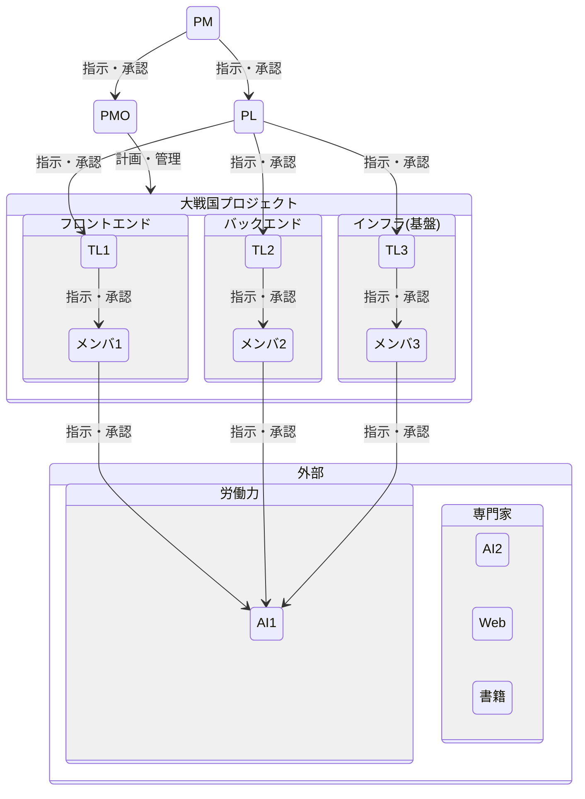

# 体制図

* PM：プロジェクトマネージャ
* PL：プロジェクトリーダ
* PMO：プロジェクトマネジメントオフィス
* TL：テックリード

 

# RAM(RACIチャート)
* 責任分担マトリクス（Responsibility Assignment Matrix）

|区分|役割|ヒト|管理|ローカル|Next.js|NestJS|RDB|認証|クラウド|
|---|---|---|---|---|---|---|---|---|---|
|PJ管理|PM|リョウ|I|-|-|-|-|-|-|
|PJ管理|PL|リョウ|A|I|I|I|I|I|I|
|PJ管理|PMO|けびん|R|I|I|I|I|I|I|
|フロント|TL|リョウ|-|-|A|-|-|-|-|
|フロント|メンバ|リョウ|-|-|R|-|-|-|-|
|バック|TL|リョウ|-|-|-|A|A|A|-|
|バック|メンバ|リョウ|-|-|-|R|R|R|-|
|インフラ|TL|リョウ|-|A|-|-|-|-|A|
|インフラ|メンバ|リョウ|-|R|-|-|-|-|R|
|外部|労働力|AI|-|R|R|R|R|R|R|
|外部|専門家|AI|C|C|C|C|C|C|C|
|外部|専門家|Web|C|C|C|C|C|C|C|
|外部|専門家|書籍|C|C|C|C|C|C|C|

* Responsible (実行責任者): 実際に作業を行う人。
* Accountable (説明責任者/承認者): 最終的な成果に責任を持ち、承認する人。通常1名のみ。
* Consulted (協業先/相談先): 決定や行動の前に意見を求められる人。双方向のコミュニケーションが必要。
* Informed (報告先/情報提供先): 決定や行動の後に通知される人。一方的なコミュニケーション。